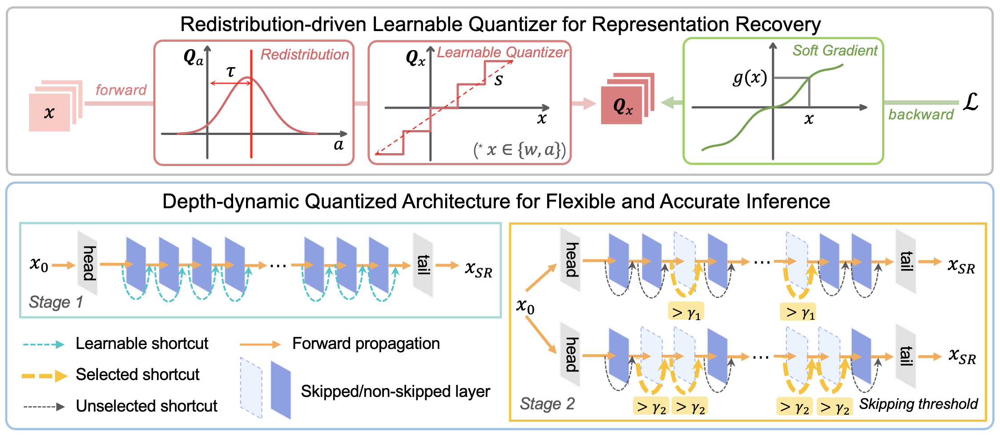

# QuantSR: Accurate Low-bit Quantization for Efficient Image Super-Resolution
This project is the official implementation of our accepted NeurIPS 2023 (spotlight) paper *QuantSR: Accurate Low-bit Quantization for Efficient Image Super-Resolution* [[PDF](https://openreview.net/forum?id=3gamyee9Yh)]. Created by researchers from Beihang University and ETH Zürich.



## Introduction

Low-bit quantization in image super-resolution (SR) has attracted copious attention in recent research due to its ability to reduce parameters and operations significantly. However, many quantized SR models suffer from accuracy degradation compared to their full-precision counterparts, especially at ultra-low bit widths (2-4 bits), limiting their practical applications. To address this issue, we propose a novel quantized image SR network, called **QuantSR**, which achieves accurate and efficient SR processing under low-bit quantization. To overcome the representation homogeneity caused by quantization in the network, we introduce the Redistribution-driven Learnable Quantizer (RLQ). This is accomplished through an inference-agnostic efficient redistribution design, which adds additional information in both forward and backward passes to improve the representation ability of quantized networks. Furthermore, to achieve flexible inference and break the upper limit of accuracy, we propose the Depth-dynamic Quantized Architecture (DQA). Our DQA allows for the trade-off between efficiency and accuracy during inference through weight sharing. Our comprehensive experiments show that QuantSR outperforms existing state-of-the-art quantized SR networks in terms of accuracy while also providing more competitive computational efficiency. In addition, we demonstrate the scheme's satisfactory architecture generality by providing QuantSR-C and QuantSR-T for both convolution and Transformer versions, respectively.

## Dependencies

```bash
# Go to the default directory
pip install -r requirements.txt
python setup.py develop
```

## Execution

```bash
# We provide script to test our 4-bit QuantSR-C
sh test.sh
```

## Citation

If you find our work useful in your research, please consider citing:

```shell
@inproceedings{qin2023quantsr,
  author    = {Haotong Qin and Yulun Zhang and Yifu Ding and Yifan liu and Xianglong Liu and Martin Danelljan and Fisher Yu},
  title     = {QuantSR: Accurate Low-bit Quantization for Efficient Image Super-Resolution},
  booktitle = {Conference on Neural Information Processing Systems (NeurIPS)},
  year      = {2023}
}
```
